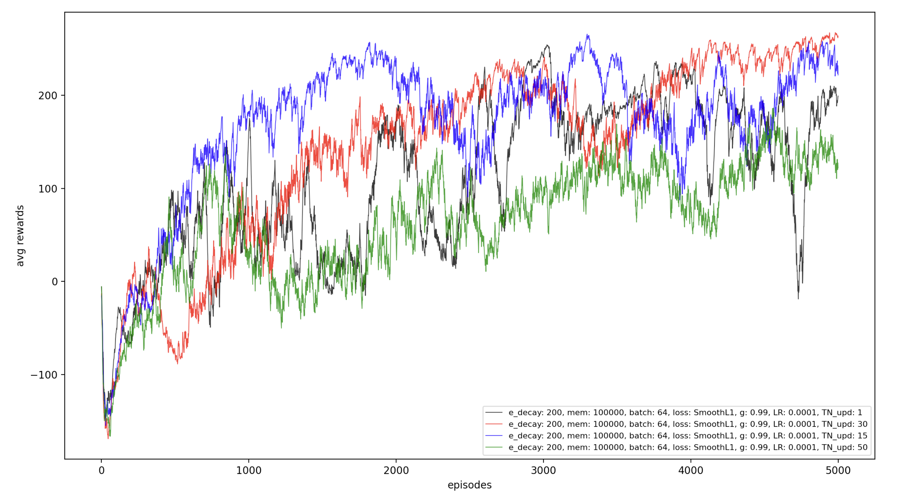
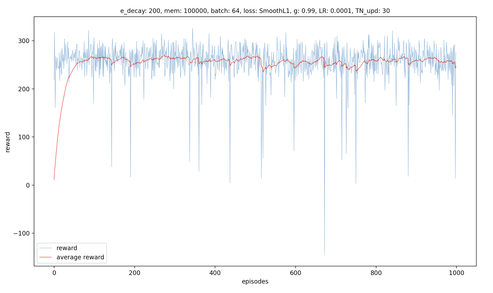

# Gym-LunarLander
This repo contains an implementation of a deep reinforcement learning agent with double Q-learning and experience replay [[1]](#1), trained on the [Gym LunarLander environment](https://www.gymlibrary.dev/)

## Implementation Details:

The following hyperparameters were used to train the agent:

| Parameter       | Value          | Parameter       | Value          |
|------------------|-----------------|------------------|-----------------|
| Network arch.   | 8x32x32x4       | Replay mem. size | 100000         |
| Loss funct.     | SmoothLlLoss    | Replay batch size | 64            |
| Optimization funct. | Adam        | e max            | 0.9            |
| Learning rate   | 0.0001          | e-decay cte       | 200            |
| TNN update interval | 30          | Gamma            | 0.99           |

The action selection policy is a regular ε-greedy policy with a decaying ε.

## results

Using the above hyperparameter resulted in the following training results:

and the following evaluation plot: 

## How to run the code:
The file [main.py](./main.py) can be used for both training one or more agents and evaluating the (trained) agent. Simply decomment the appropriate lines as mentioned in the file. For the actual implementation details, please consult the code documentation.

## References:
<a id="1">[1]</a> 
Hado van Hasselt, Arthur Guez, and David Silver. Deep Reinforcement Learning with Double
Q-learning. 2015. url: https://arxiv.org/abs/1509.06461v3.